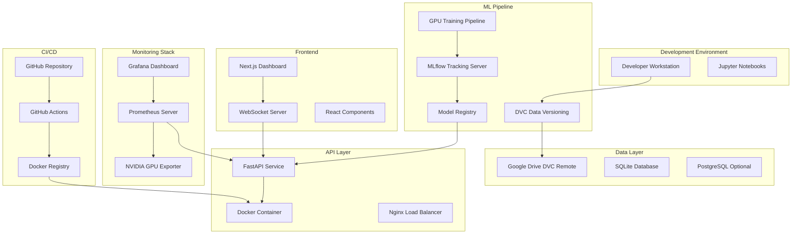

# Design Document

## Overview

The MLOps Platform is a comprehensive, production-ready machine learning system designed for California Housing price prediction with GPU acceleration, real-time monitoring, and advanced web interface. The platform demonstrates enterprise-level MLOps practices including data versioning with DVC, GPU-accelerated model training, containerized API deployment, automated CI/CD pipelines, and comprehensive observability.

### Key Design Principles

- **GPU-First Architecture**: Leverage CUDA acceleration for all computationally intensive operations
- **Cloud-Native Design**: Containerized services with environment-based configuration
- **Real-Time Capabilities**: WebSocket-enabled dashboard for live monitoring and interaction
- **Production-Ready**: Comprehensive logging, monitoring, and error handling
- **Scalable Architecture**: Microservices approach with clear separation of concerns

## Architecture

### High-Level System Architecture



### Technology Stack

**Core ML Technologies:**
- Python 3.9+ with CUDA 12.8+ support
- PyTorch with CUDA for neural networks
- XGBoost with gpu_hist tree method
- RAPIDS cuML for GPU-accelerated scikit-learn algorithms
- LightGBM with GPU acceleration
- MLflow for experiment tracking and model registry

**API and Containerization:**
- FastAPI with Pydantic validation
- Docker with NVIDIA Container Runtime
- Multi-stage builds for optimized images
- CUDA base images (nvidia/cuda:12.8-runtime-ubuntu22.04)

**Frontend and Real-Time:**
- Next.js 15 with App Router and TypeScript
- TailwindCSS with shadcn/ui components
- WebSocket for real-time communication
- Chart.js/Recharts for data visualization

**Monitoring and Observability:**
- Prometheus for metrics collection
- Grafana for dashboard visualization
- nvidia-ml-py for GPU metrics
- Structured logging with Python logging

## Components and Interfaces

### 1. Data Management Component

**Purpose**: Handle data versioning, loading, and preprocessing with DVC integration.

**Key Classes:**
```python
class DataManager:
    def __init__(self, config: DataConfig):
        self.dvc_remote_url = os.getenv('DVC_REMOTE_URL')
        self.data_path = config.data_path
    
    def setup_dvc_remote(self) -> None:
        """Configure DVC remote using environment variables"""
    
    def load_california_housing(self) -> pd.DataFrame:
        """Load and preprocess California Housing dataset"""
    
    def validate_data_quality(self, data: pd.DataFrame) -> DataQualityReport:
        """Validate data quality and generate report"""

class DataConfig(BaseModel):
    data_path: str = "data/raw/"
    dvc_remote_name: str = "gdrive"
    validation_rules: Dict[str, Any]
```

**Interfaces:**
- Environment variable configuration for DVC remote URL
- Data validation and quality reporting
- Integration with MLflow for data versioning tracking

### 2. GPU-Accelerated Training Component

**Purpose**: Orchestrate training of multiple GPU-accelerated models with comprehensive experiment tracking.

**Key Classes:**
```python
class GPUModelTrainer:
    def __init__(self, mlflow_config: MLflowConfig):
        self.device = torch.device('cuda' if torch.cuda.is_available() else 'cpu')
        self.mlflow_client = MlflowClient()
    
    def train_cuml_models(self, X_train, y_train) -> Dict[str, Any]:
        """Train Linear Regression and Random Forest using cuML"""
    
    def train_xgboost_gpu(self, X_train, y_train) -> xgb.XGBRegressor:
        """Train XGBoost with GPU acceleration"""
    
    def train_pytorch_nn(self, X_train, y_train) -> torch.nn.Module:
        """Train neural network with mixed precision"""
    
    def train_lightgbm_gpu(self, X_train, y_train) -> lgb.LGBMRegressor:
        """Train LightGBM with GPU support"""
    
    def log_gpu_metrics(self) -> None:
        """Log GPU utilization and memory usage to MLflow"""

class ModelConfig(BaseModel):
    xgboost_params: Dict[str, Any] = {
        'tree_method': 'gpu_hist',
        'gpu_id': 0,
        'max_depth': 12,
        'n_estimators': 5000,
        'learning_rate': 0.01
    }
    pytorch_config: Dict[str, Any] = {
        'hidden_layers': [512, 256, 128, 64],
        'batch_size': 2048,
        'epochs': 500,
        'device': 'cuda',
        'precision': 'mixed'
    }
```

**Interfaces:**
- MLflow integration for experiment tracking
- GPU metrics collection and logging
- Model artifact storage and versioning
- Performance comparison and model selection

### 3. FastAPI Service Component

**Purpose**: Provide high-performance API endpoints for model inference with comprehensive validation.

**Key Classes:**
```python
class PredictionAPI:
    def __init__(self):
        self.model = self.load_best_model()
        self.metrics_collector = PrometheusMetrics()
    
    async def predict_single(self, request: HousingPredictionRequest) -> PredictionResponse:
        """Handle single prediction requests"""
    
    async def predict_batch(self, requests: List[HousingPredictionRequest]) -> BatchPredictionResponse:
        """Handle batch prediction requests"""
    
    def get_model_info(self) -> ModelInfo:
        """Return model metadata and performance metrics"""

class HousingPredictionRequest(BaseModel):
    MedInc: float = Field(..., ge=0, le=15, description="Median income in block group")
    HouseAge: float = Field(..., ge=1, le=52, description="Median house age in block group")
    AveRooms: float = Field(..., ge=1, le=20, description="Average number of rooms per household")
    AveBedrms: float = Field(..., ge=0, le=5, description="Average number of bedrooms per household")
    Population: float = Field(..., ge=3, le=35682, description="Block group population")
    AveOccup: float = Field(..., ge=0.5, le=1243, description="Average number of household members")
    Latitude: float = Field(..., ge=32.54, le=41.95, description="Block group latitude")
    Longitude: float = Field(..., ge=-124.35, le=-114.31, description="Block group longitude")
    
    @validator('*')
    def validate_housing_data(cls, v, field):
        """Custom validation for housing data edge cases"""
        return v

class PredictionResponse(BaseModel):
    prediction: float
    model_version: str
    confidence_interval: Optional[Tuple[float, float]]
    processing_time_ms: float
```

**Interfaces:**
- Pydantic validation with custom validators
- Prometheus metrics integration
- MLflow model loading and versioning
- Structured logging for all requests

### 4. Next.js Dashboard Component

**Purpose**: Provide comprehensive web interface for real-time monitoring, training management, and data exploration.

**Key Components:**
```typescript
// Real-time prediction dashboard
interface PredictionDashboardProps {
  websocketUrl: string;
  apiBaseUrl: string;
}

const PredictionDashboard: React.FC<PredictionDashboardProps> = ({ websocketUrl, apiBaseUrl }) => {
  const { predictions, isConnected } = useWebSocket(websocketUrl);
  const [predictionHistory, setPredictionHistory] = useState<Prediction[]>([]);
  
  return (
    <div className="grid grid-cols-1 lg:grid-cols-2 gap-6">
      <PredictionForm onSubmit={handlePrediction} />
      <RealTimePredictionFeed predictions={predictions} />
      <PerformanceMetrics metrics={performanceData} />
      <PredictionHistoryChart data={predictionHistory} />
    </div>
  );
};

// Training interface with GPU monitoring
interface TrainingInterfaceProps {
  onStartTraining: (config: TrainingConfig) => void;
  onPauseTraining: () => void;
  onStopTraining: () => void;
}

const TrainingInterface: React.FC<TrainingInterfaceProps> = ({ onStartTraining, onPauseTraining, onStopTraining }) => {
  const { trainingStatus, gpuMetrics } = useTrainingStatus();
  
  return (
    <div className="space-y-6">
      <TrainingControls 
        status={trainingStatus}
        onStart={onStartTraining}
        onPause={onPauseTraining}
        onStop={onStopTraining}
      />
      <GPUMonitoringPanel metrics={gpuMetrics} />
      <TrainingProgressChart progress={trainingStatus.progress} />
      <ModelComparisonTable models={trainingStatus.models} />
    </div>
  );
};

// Database explorer for prediction history
const DatabaseExplorer: React.FC = () => {
  const [predictions, setPredictions] = useState<PredictionRecord[]>([]);
  const [filters, setFilters] = useState<FilterConfig>({});
  const [pagination, setPagination] = useState<PaginationConfig>({ page: 1, limit: 50 });
  
  return (
    <div className="space-y-4">
      <FilterPanel filters={filters} onFiltersChange={setFilters} />
      <PredictionTable 
        data={predictions}
        pagination={pagination}
        onPaginationChange={setPagination}
      />
      <ExportControls onExport={handleExport} />
    </div>
  );
};
```

**Interfaces:**
- WebSocket connection for real-time updates
- REST API integration for data fetching
- State management with React hooks
- Component composition with TypeScript interfaces

### 5. Monitoring and Observability Component

**Purpose**: Comprehensive system monitoring with GPU metrics, performance tracking, and alerting.

**Key Classes:**
```python
class PrometheusMetrics:
    def __init__(self):
        self.prediction_duration = Histogram('prediction_duration_seconds', 'Time spent on predictions')
        self.requests_total = Counter('requests_total', 'Total requests', ['method', 'endpoint'])
        self.gpu_utilization = Gauge('gpu_utilization_percent', 'GPU utilization percentage')
        self.gpu_memory_used = Gauge('gpu_memory_used_bytes', 'GPU memory usage in bytes')
    
    def record_prediction_time(self, duration: float) -> None:
        """Record prediction processing time"""
    
    def increment_request_count(self, method: str, endpoint: str) -> None:
        """Increment request counter"""
    
    def update_gpu_metrics(self) -> None:
        """Update GPU utilization and memory metrics"""

class GPUMonitor:
    def __init__(self):
        self.nvidia_ml = nvidia_ml_py.nvmlInit()
    
    def get_gpu_metrics(self) -> Dict[str, float]:
        """Collect comprehensive GPU metrics"""
        handle = nvidia_ml_py.nvmlDeviceGetHandleByIndex(0)
        return {
            'utilization': nvidia_ml_py.nvmlDeviceGetUtilizationRates(handle).gpu,
            'memory_used': nvidia_ml_py.nvmlDeviceGetMemoryInfo(handle).used,
            'memory_total': nvidia_ml_py.nvmlDeviceGetMemoryInfo(handle).total,
            'temperature': nvidia_ml_py.nvmlDeviceGetTemperature(handle, nvidia_ml_py.NVML_TEMPERATURE_GPU),
            'power_usage': nvidia_ml_py.nvmlDeviceGetPowerUsage(handle)
        }
```

**Interfaces:**
- Prometheus metrics exposition
- Grafana dashboard configuration
- Alert manager integration
- Real-time metrics streaming via WebSocket

## Data Models

### Core Data Structures

```python
# California Housing Dataset Schema
class CaliforniaHousingData(BaseModel):
    MedInc: float  # Median income in block group
    HouseAge: float  # Median house age in block group
    AveRooms: float  # Average number of rooms per household
    AveBedrms: float  # Average number of bedrooms per household
    Population: float  # Block group population
    AveOccup: float  # Average number of household members
    Latitude: float  # Block group latitude
    Longitude: float  # Block group longitude
    target: Optional[float]  # Median house value (target variable)

# Model Training Configuration
class TrainingConfig(BaseModel):
    model_type: Literal['linear_regression', 'random_forest', 'xgboost', 'neural_network', 'lightgbm']
    hyperparameters: Dict[str, Any]
    gpu_enabled: bool = True
    mixed_precision: bool = True
    early_stopping: bool = True
    validation_split: float = 0.2

# Experiment Tracking Schema
class ExperimentRun(BaseModel):
    run_id: str
    experiment_id: str
    model_type: str
    hyperparameters: Dict[str, Any]
    metrics: Dict[str, float]
    gpu_metrics: Dict[str, float]
    artifacts: List[str]
    start_time: datetime
    end_time: Optional[datetime]
    status: Literal['running', 'completed', 'failed']

# Prediction Request/Response Schema
class PredictionRequest(BaseModel):
    features: CaliforniaHousingData
    model_version: Optional[str] = None
    return_confidence: bool = False

class PredictionResponse(BaseModel):
    prediction: float
    model_version: str
    confidence_interval: Optional[Tuple[float, float]]
    processing_time_ms: float
    request_id: str
    timestamp: datetime
```

### Database Schema

```sql
-- Prediction logging table
CREATE TABLE predictions (
    id SERIAL PRIMARY KEY,
    request_id VARCHAR(36) UNIQUE NOT NULL,
    model_version VARCHAR(50) NOT NULL,
    input_features JSONB NOT NULL,
    prediction FLOAT NOT NULL,
    confidence_lower FLOAT,
    confidence_upper FLOAT,
    processing_time_ms FLOAT NOT NULL,
    timestamp TIMESTAMP DEFAULT CURRENT_TIMESTAMP,
    user_agent TEXT,
    ip_address INET
);

-- Model performance tracking
CREATE TABLE model_performance (
    id SERIAL PRIMARY KEY,
    model_version VARCHAR(50) NOT NULL,
    metric_name VARCHAR(50) NOT NULL,
    metric_value FLOAT NOT NULL,
    dataset_version VARCHAR(50),
    timestamp TIMESTAMP DEFAULT CURRENT_TIMESTAMP
);

-- System metrics logging
CREATE TABLE system_metrics (
    id SERIAL PRIMARY KEY,
    metric_name VARCHAR(50) NOT NULL,
    metric_value FLOAT NOT NULL,
    labels JSONB,
    timestamp TIMESTAMP DEFAULT CURRENT_TIMESTAMP
);
```

## Error Handling

### Error Classification and Response Strategy

**1. Input Validation Errors**
```python
class ValidationErrorHandler:
    def handle_pydantic_error(self, error: ValidationError) -> JSONResponse:
        return JSONResponse(
            status_code=422,
            content={
                "error": "validation_error",
                "message": "Invalid input data",
                "details": error.errors(),
                "request_id": str(uuid.uuid4())
            }
        )
```

**2. Model Loading and Inference Errors**
```python
class ModelErrorHandler:
    def handle_model_loading_error(self, error: Exception) -> JSONResponse:
        logger.error(f"Model loading failed: {error}")
        return JSONResponse(
            status_code=503,
            content={
                "error": "model_unavailable",
                "message": "Model service temporarily unavailable",
                "retry_after": 30
            }
        )
```

**3. GPU and Resource Errors**
```python
class ResourceErrorHandler:
    def handle_gpu_error(self, error: Exception) -> JSONResponse:
        logger.error(f"GPU error: {error}")
        return JSONResponse(
            status_code=503,
            content={
                "error": "gpu_unavailable",
                "message": "GPU resources temporarily unavailable",
                "fallback": "cpu_inference_available"
            }
        )
```

## Testing Strategy

### 1. Unit Testing
- **Model Training Tests**: Validate GPU acceleration, hyperparameter handling, and MLflow integration
- **API Endpoint Tests**: Test all FastAPI endpoints with various input scenarios
- **Data Processing Tests**: Validate data loading, preprocessing, and DVC integration
- **Validation Tests**: Test Pydantic models with edge cases and invalid inputs

### 2. Integration Testing
- **End-to-End API Tests**: Test complete prediction workflow from request to response
- **Database Integration Tests**: Validate logging and data persistence
- **MLflow Integration Tests**: Test experiment tracking and model registry operations
- **GPU Integration Tests**: Validate CUDA functionality and performance

### 3. Performance Testing
- **Load Testing**: Test API performance under concurrent requests
- **GPU Performance Tests**: Validate training and inference performance
- **Memory Usage Tests**: Monitor GPU and system memory consumption
- **Latency Tests**: Measure prediction response times

### 4. Frontend Testing
- **Component Tests**: Test React components with Jest and React Testing Library
- **WebSocket Tests**: Validate real-time communication functionality
- **User Interface Tests**: Test dashboard interactions and data visualization
- **Accessibility Tests**: Ensure WCAG compliance for all UI components

### Test Configuration
```python
# pytest configuration for GPU testing
@pytest.fixture
def gpu_available():
    return torch.cuda.is_available()

@pytest.mark.skipif(not torch.cuda.is_available(), reason="GPU not available")
def test_gpu_model_training():
    trainer = GPUModelTrainer()
    model = trainer.train_xgboost_gpu(X_train, y_train)
    assert model.get_params()['tree_method'] == 'gpu_hist'

# FastAPI testing with TestClient
def test_prediction_endpoint():
    response = client.post("/predict", json=valid_housing_data)
    assert response.status_code == 200
    assert "prediction" in response.json()
```

This comprehensive design provides a solid foundation for implementing the MLOps platform with all required features for maximum marks while maintaining production-ready quality and performance.