# CI/CD Pipeline Architecture Documentation

## 🏗️ System Architecture Overview

### High-Level Architecture

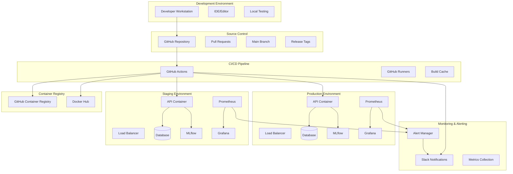

## 🔄 Workflow Architecture

### 1. CI Workflow Architecture

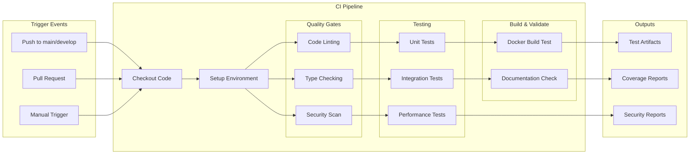

### 2. Docker Build & Push Architecture

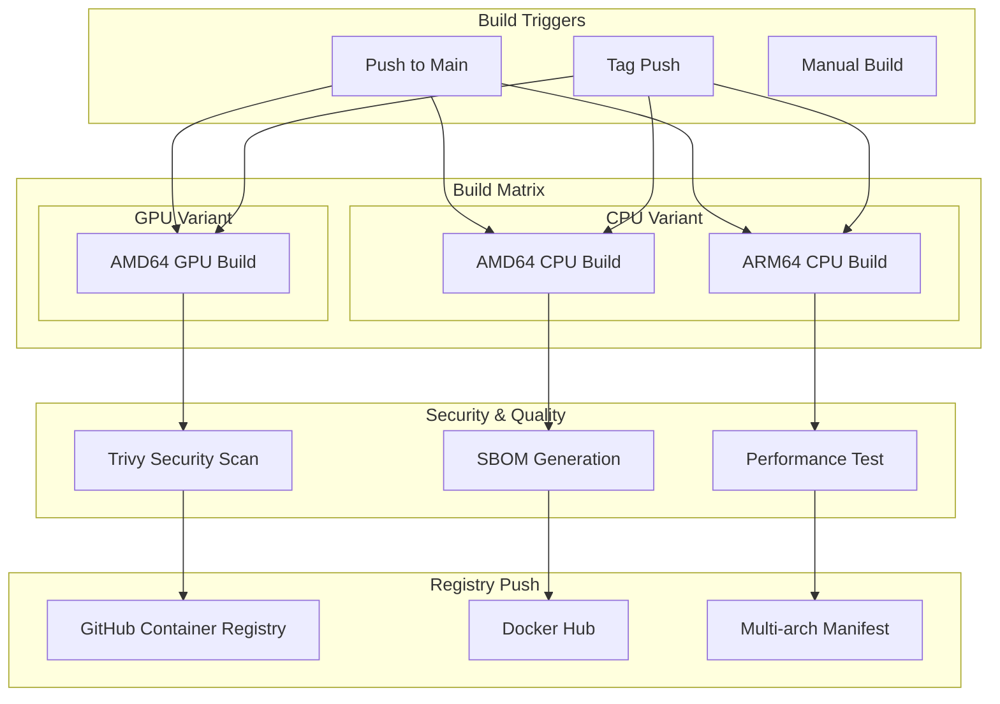

### 3. Deployment Architecture

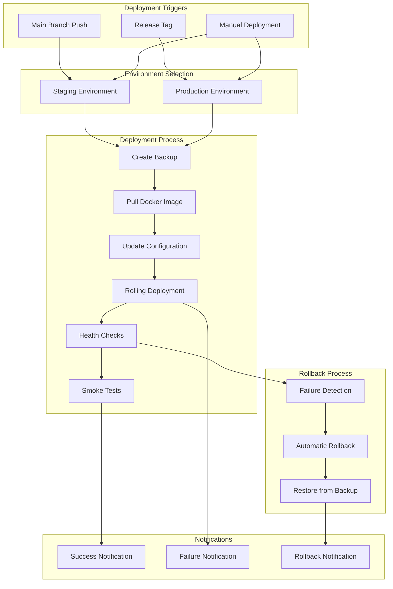

## 🔧 Component Architecture

### 1. GitHub Actions Runner Architecture

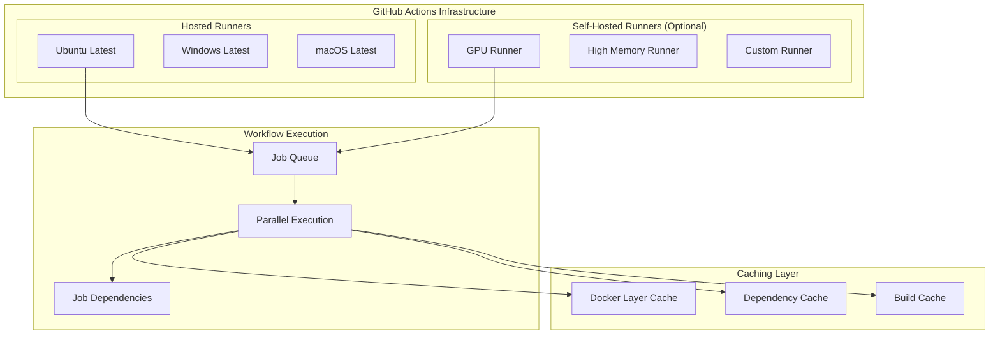

### 2. Container Architecture

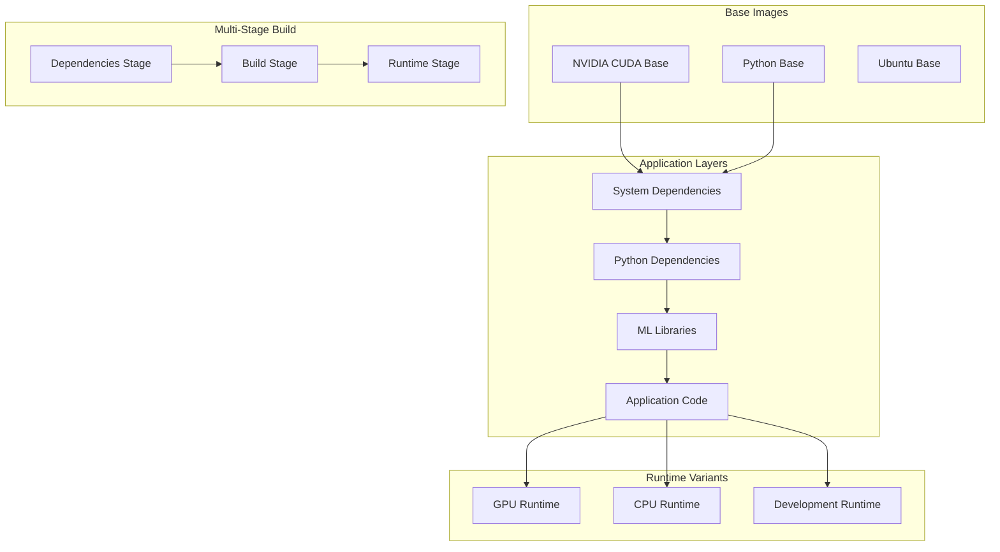

### 3. Monitoring Architecture

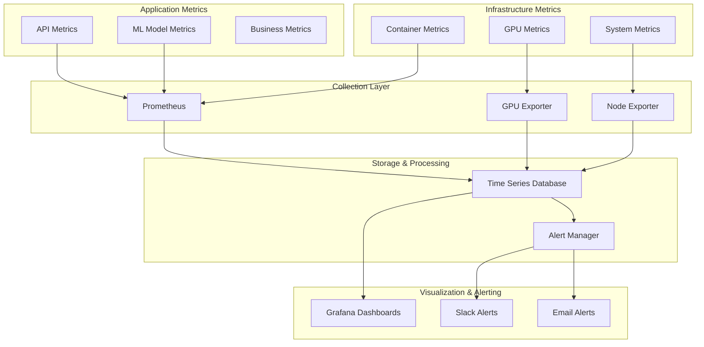

## 🔐 Security Architecture

### 1. Security Layers

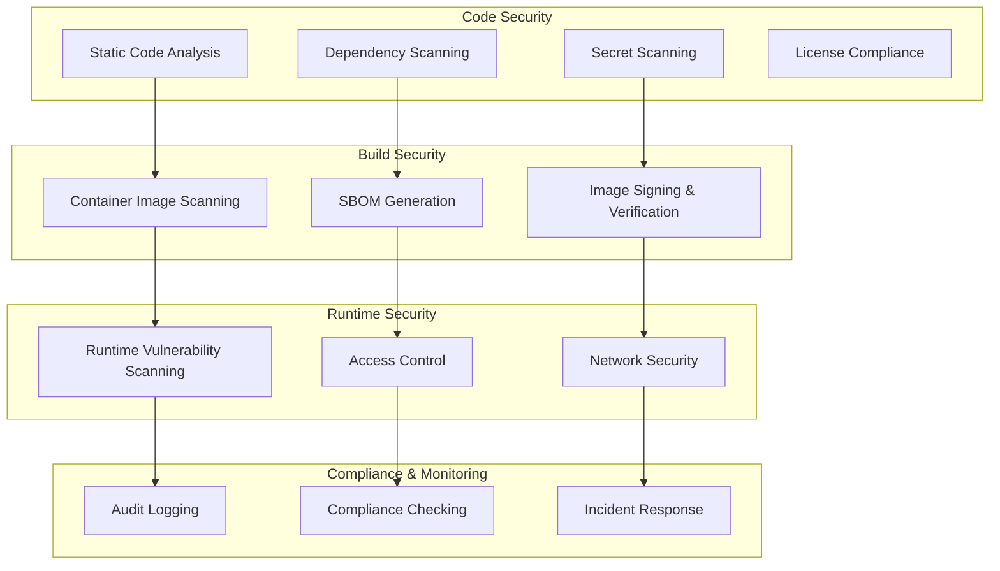

### 2. Secret Management Architecture

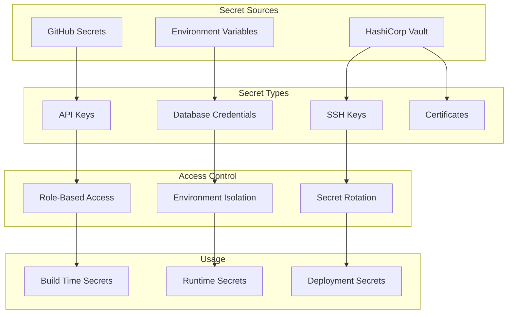

## 📊 Data Flow Architecture

### 1. CI/CD Data Flow

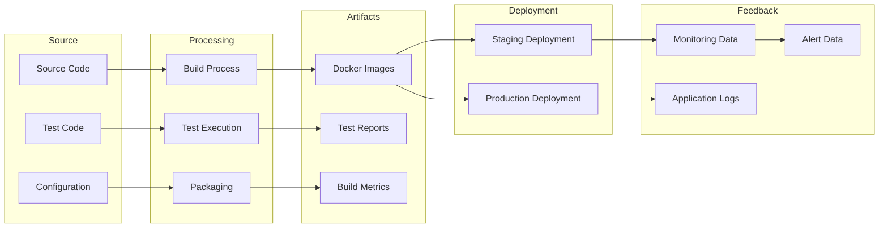

### 2. ML Model Data Flow

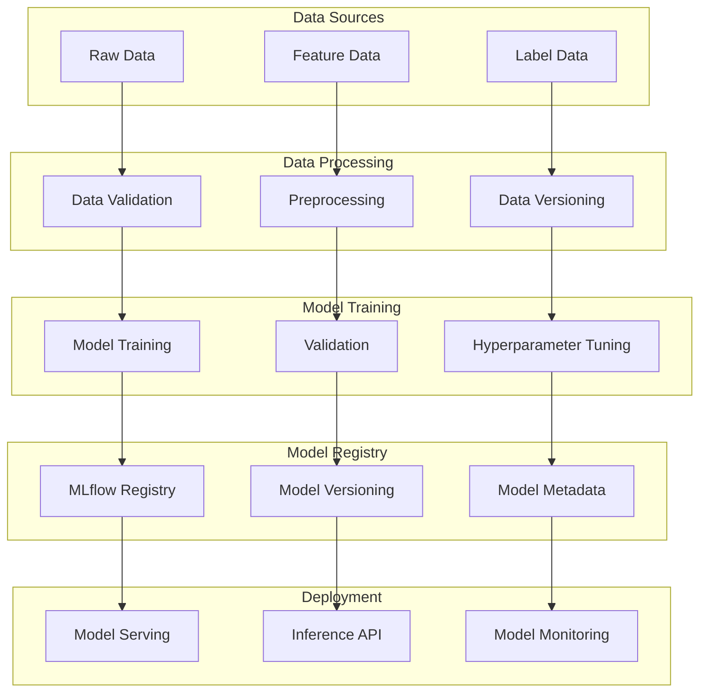

## 🚀 Scalability Architecture

### 1. Horizontal Scaling

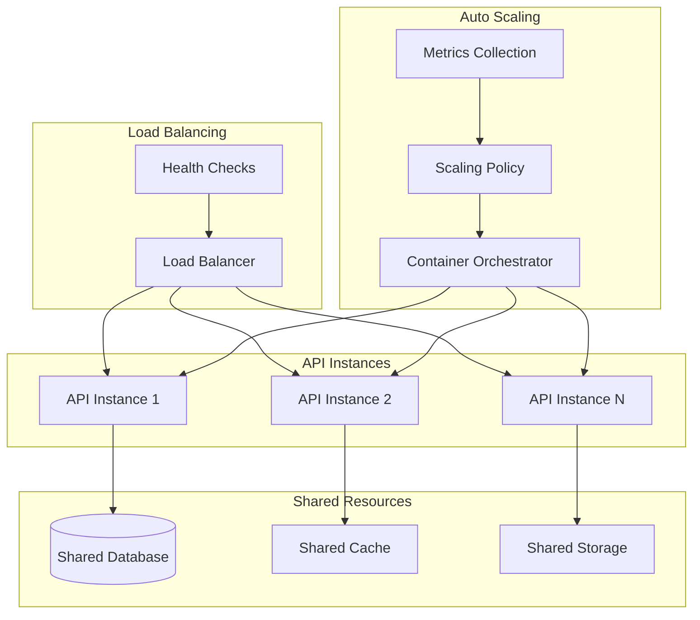

### 2. Performance Optimization

```mermaid
graph TB
    subgraph "Caching Layers"
        CDN[Content Delivery Network]
        REDIS[Redis Cache]
        APP_CACHE[Application Cache]
    end
    
    subgraph "Database Optimization"
        READ_REPLICAS[Read Replicas]
        CONNECTION_POOL[Connection Pooling]
        QUERY_OPT[Query Optimization]
    end
    
    subgraph "Resource Optimization"
        GPU_SHARING[GPU Sharing]
        MEMORY_OPT[Memory Optimization]
        CPU_OPT[CPU Optimization]
    end
    
    subgraph "Monitoring & Tuning"
        PERF_MONITORING[Performance Monitoring]
        BOTTLENECK_ANALYSIS[Bottleneck Analysis]
        AUTO_TUNING[Auto Tuning]
    end
    
    CDN --> REDIS
    REDIS --> APP_CACHE
    
    READ_REPLICAS --> CONNECTION_POOL
    CONNECTION_POOL --> QUERY_OPT
    
    GPU_SHARING --> MEMORY_OPT
    MEMORY_OPT --> CPU_OPT
    
    PERF_MONITORING --> BOTTLENECK_ANALYSIS
    BOTTLENECK_ANALYSIS --> AUTO_TUNING
```

## 🔄 Disaster Recovery Architecture

### 1. Backup Strategy

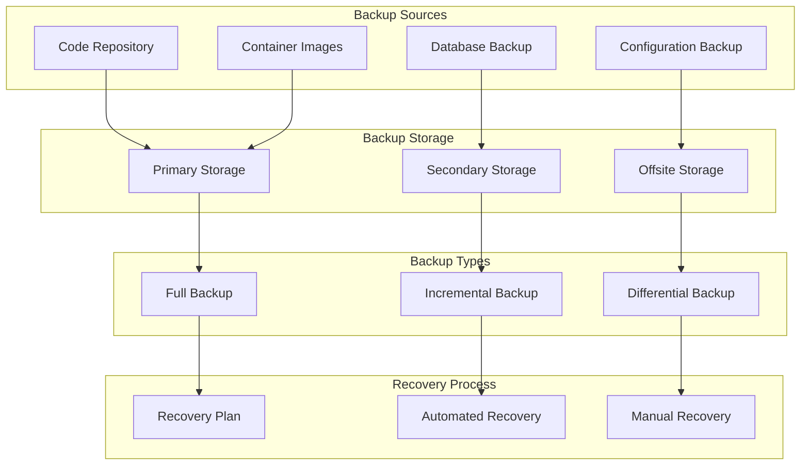

### 2. High Availability

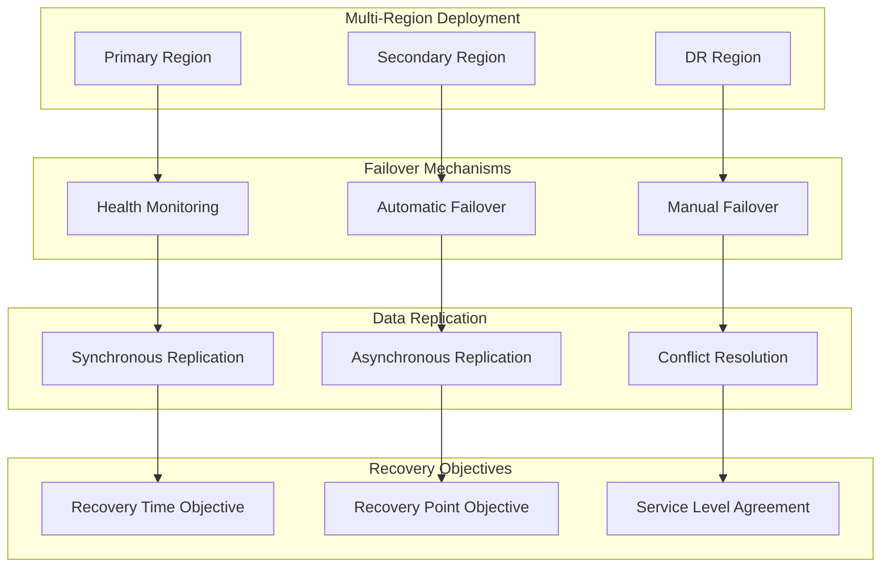

---

This architecture documentation provides a comprehensive view of the CI/CD pipeline's structure, components, and data flows. Use this as a reference for understanding the system's design and for making architectural decisions.