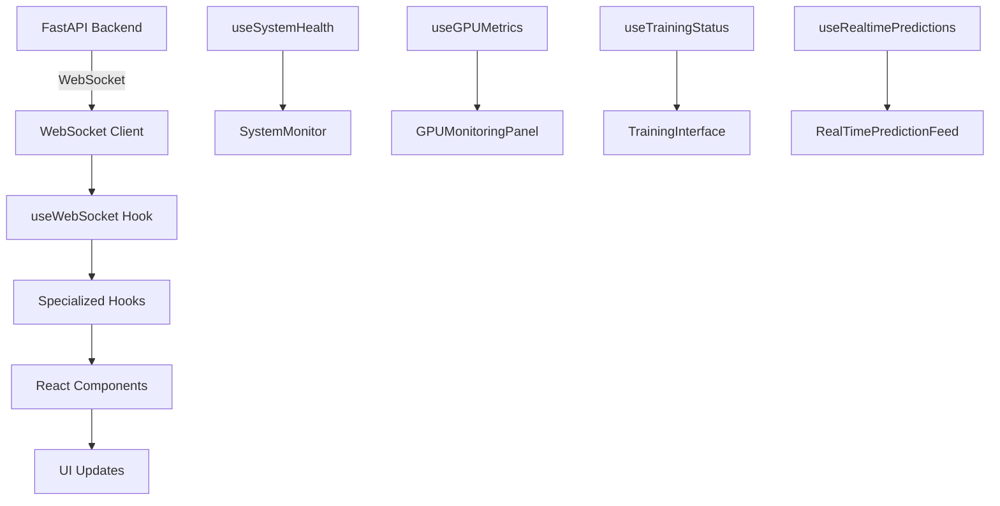
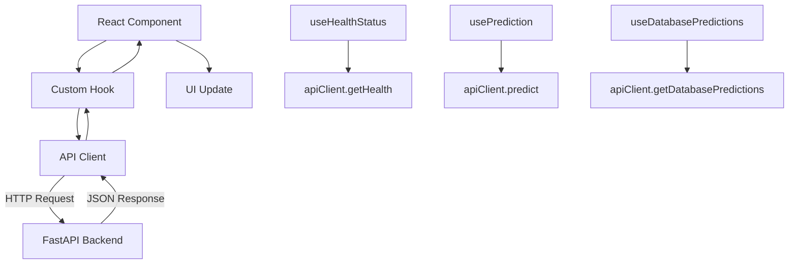

# MLOps Platform Next.js Dashboard Documentation

## 🎯 Overview

The MLOps Platform Dashboard is a comprehensive Next.js 15 application that provides a modern, responsive web interface for monitoring and managing the California Housing Prediction MLOps platform. Built with TypeScript, Tailwind CSS, and shadcn/ui components, it offers real-time monitoring, prediction management, model training oversight, and system administration capabilities.

## 🏗️ Architecture

### Technology Stack

- **Framework**: Next.js 15.4.4 with App Router
- **Language**: TypeScript 5.x
- **Styling**: Tailwind CSS 4.x with shadcn/ui components
- **State Management**: React hooks with custom state management
- **Real-time Communication**: WebSocket integration
- **Charts & Visualization**: Recharts 3.1.0
- **HTTP Client**: Fetch API with custom API client
- **Build Tool**: Turbopack for fast development

### Project Structure

```
dashboard/
├── src/
│   ├── app/                    # Next.js App Router pages
│   │   ├── page.tsx           # Main dashboard page
│   │   ├── monitoring/        # System monitoring pages
│   │   ├── training/          # Model training pages
│   │   ├── database/          # Database explorer pages
│   │   └── layout.tsx         # Root layout
│   ├── components/            # React components
│   │   ├── dashboard/         # Dashboard-specific components
│   │   ├── monitoring/        # System monitoring components
│   │   ├── training/          # Model training components
│   │   ├── database/          # Database management components
│   │   ├── layout/            # Layout components (Header, Sidebar)
│   │   └── ui/                # Reusable UI components (shadcn/ui)
│   ├── hooks/                 # Custom React hooks
│   │   ├── useApi.ts          # API interaction hooks
│   │   └── useWebSocket.ts    # WebSocket communication hooks
│   ├── services/              # External service integrations
│   │   ├── api.ts             # HTTP API client
│   │   └── websocket.ts       # WebSocket client
│   ├── types/                 # TypeScript type definitions
│   │   └── index.ts           # Shared type definitions
│   └── lib/                   # Utility functions
├── public/                    # Static assets
├── package.json               # Dependencies and scripts
├── tailwind.config.js         # Tailwind CSS configuration
├── tsconfig.json              # TypeScript configuration
└── next.config.js             # Next.js configuration
```

## 🚀 Getting Started

### Prerequisites

- Node.js 18.x or higher
- npm or yarn package manager
- MLOps Platform API running (default: http://localhost:8000)

### Installation

1. **Navigate to dashboard directory:**
   ```bash
   cd dashboard
   ```

2. **Install dependencies:**
   ```bash
   npm install
   ```

3. **Configure environment variables:**
   ```bash
   # Create .env.local file
   NEXT_PUBLIC_API_URL=http://localhost:8000
   NEXT_PUBLIC_WS_URL=ws://localhost:8000/ws
   ```

4. **Start development server:**
   ```bash
   npm run dev
   ```

5. **Access the dashboard:**
   - Development: http://localhost:3000
   - Production build: `npm run build && npm start`

### Environment Configuration

Create a `.env.local` file in the dashboard directory:

```env
# API Configuration
NEXT_PUBLIC_API_URL=http://localhost:8000
NEXT_PUBLIC_WS_URL=ws://localhost:8000/ws

# Feature Flags
NEXT_PUBLIC_ENABLE_MONITORING=true
NEXT_PUBLIC_ENABLE_TRAINING=true
NEXT_PUBLIC_ENABLE_DATABASE=true

# Development Settings
NEXT_PUBLIC_DEBUG=false
NEXT_PUBLIC_LOG_LEVEL=info
```

## 📱 Dashboard Features

### 1. Main Dashboard (`/`)

**Overview Page** - Central hub for platform monitoring and quick actions

**Key Components:**
- **DashboardOverview**: Main dashboard layout with navigation and summary cards
- **PredictionDashboard**: Real-time prediction interface and history
- **PredictionForm**: Interactive form for making housing price predictions
- **RealTimePredictionFeed**: Live feed of recent predictions with WebSocket updates
- **PerformanceMetrics**: System performance indicators and API health status
- **PredictionVisualization**: Charts and graphs for prediction data analysis

**Features:**
- Real-time prediction submission and results
- Live prediction feed with WebSocket updates
- Performance metrics and system health indicators
- Interactive charts for prediction data visualization
- Quick access to all platform features

**Usage:**
```typescript
// Making a prediction
const predictionData = {
  MedInc: 8.3252,
  HouseAge: 41.0,
  AveRooms: 6.984127,
  AveBedrms: 1.023810,
  Population: 322.0,
  AveOccup: 2.555556,
  Latitude: 37.88,
  Longitude: -122.23
};

// Submit via PredictionForm component
// Results appear in RealTimePredictionFeed
```

### 2. System Monitoring (`/monitoring`)

**Comprehensive System Monitoring** - Real-time system health and performance monitoring

**Key Components:**
- **SystemMonitor**: Live system metrics with CPU, memory, and GPU monitoring
- **ErrorLogDisplay**: Error log viewer with filtering and search capabilities
- **AlertSystem**: System alerts and notifications management
- **PerformanceVisualization**: Historical performance trends and charts

**Features:**
- **Live System Metrics**: CPU usage, memory consumption, disk usage, network I/O
- **GPU Monitoring**: Real-time GPU utilization, temperature, memory usage, power consumption
- **API Health Status**: Response times, error rates, active connections, uptime tracking
- **Error Log Management**: Searchable error logs with filtering by level and time range
- **Alert System**: System health alerts with severity levels and resolution tracking
- **Performance Charts**: Historical trends with interactive time range selection
- **Real-time Updates**: WebSocket integration for live data updates

**Usage:**
```typescript
// Access monitoring data
const { systemHealth, alerts, clearAlerts } = useSystemHealth();
const { gpuMetrics, metricsHistory } = useGPUMetrics();
const { isConnected } = useWebSocket();

// Monitor system resources
console.log(`CPU Usage: ${systemHealth?.cpu_usage}%`);
console.log(`GPU Temperature: ${gpuMetrics?.temperature}°C`);
```

**Monitoring Tabs:**
- **Overview**: System status cards and recent alerts
- **System**: Detailed CPU, memory, disk, and network metrics
- **API Health**: API performance metrics and health status
- **Error Logs**: Searchable error logs with filtering options
- **Alerts**: System alerts with severity-based filtering and resolution

### 3. Model Training (`/training`)

**Model Training Management** - Comprehensive model training oversight and control

**Key Components:**
- **TrainingInterface**: Main training control interface
- **TrainingControls**: Start, stop, pause, and resume training operations
- **TrainingProgressChart**: Real-time training progress visualization
- **GPUMonitoringPanel**: GPU utilization during training
- **HyperparameterTuning**: Parameter optimization interface
- **ModelComparisonTable**: Compare different model versions and performance

**Features:**
- **Training Control**: Start, stop, pause, and resume training sessions
- **Real-time Progress**: Live training progress with loss curves and metrics
- **GPU Monitoring**: GPU utilization, memory usage, and temperature during training
- **Hyperparameter Tuning**: Interactive parameter adjustment and optimization
- **Model Comparison**: Side-by-side comparison of different model versions
- **Training History**: Historical training runs with performance metrics

**Usage:**
```typescript
// Training control
const { trainingStatus, startTraining, pauseTraining, stopTraining } = useTrainingStatus();

// Start training with configuration
const trainingConfig = {
  model_type: 'xgboost',
  hyperparameters: {
    learning_rate: 0.1,
    max_depth: 6,
    n_estimators: 100
  },
  gpu_enabled: true
};

startTraining(trainingConfig);
```

### 4. Database Explorer (`/database`)

**Database Management Interface** - Comprehensive database exploration and management

**Key Components:**
- **DatabaseExplorer**: Main database interface with table browsing
- **PredictionTable**: Prediction records with filtering and pagination
- **DatabaseStats**: Database statistics and performance metrics
- **PredictionTrends**: Trend analysis and visualization
- **FilterPanel**: Advanced filtering options for database queries
- **ExportControls**: Data export functionality in multiple formats

**Features:**
- **Data Exploration**: Browse prediction records with advanced filtering
- **Statistics Dashboard**: Database performance metrics and usage statistics
- **Trend Analysis**: Prediction trends over time with interactive charts
- **Export Functionality**: Export data in CSV, JSON, and Excel formats
- **Advanced Filtering**: Filter by date range, model version, status, and custom criteria
- **Pagination**: Efficient handling of large datasets with pagination

**Usage:**
```typescript
// Database operations
const { data, loading, error, refetch } = useDatabasePredictions({
  page: 1,
  limit: 50,
  model_version: 'v1.2.3',
  start_date: '2024-01-01',
  end_date: '2024-12-31'
});

// Export data
const { exportData } = useDataExport();
await exportData({
  format: 'csv',
  model_version: 'v1.2.3',
  limit: 1000
});
```

## 🔧 Component Architecture

### Layout Components

#### Sidebar Navigation
```typescript
// dashboard/src/components/layout/Sidebar.tsx
const navigationItems = [
  { id: 'dashboard', label: 'Dashboard', href: '/', icon: Home },
  { id: 'monitoring', label: 'Monitoring', href: '/monitoring', icon: Activity },
  { id: 'training', label: 'Training', href: '/training', icon: Zap },
  { id: 'database', label: 'Database Explorer', href: '/database', icon: Database }
];
```

#### Header Component
```typescript
// dashboard/src/components/layout/Header.tsx
// Features: User profile, notifications, theme toggle, search
```

### Custom Hooks

#### API Integration Hook
```typescript
// dashboard/src/hooks/useApi.ts
export function useApi<T>(
  apiCall: () => Promise<T>,
  dependencies: React.DependencyList = []
): UseApiState<T> & { refetch: () => Promise<void> }

// Usage examples:
const { data: healthStatus, loading, error } = useHealthStatus();
const { data: modelInfo } = useModelInfo();
const { predict, loading: predicting } = usePrediction();
```

#### WebSocket Integration Hook
```typescript
// dashboard/src/hooks/useWebSocket.ts
export function useWebSocket(): {
  isConnected: boolean;
  connectionState: string;
  error: string | null;
  reconnect: () => void;
  send: (type: string, data: unknown) => void;
}

// Specialized hooks:
const { predictions, latestPrediction } = useRealtimePredictions();
const { trainingStatus } = useTrainingStatus();
const { gpuMetrics, metricsHistory } = useGPUMetrics();
const { systemHealth, alerts } = useSystemHealth();
```

### Service Layer

#### API Client
```typescript
// dashboard/src/services/api.ts
class ApiClient {
  // Health endpoints
  async getHealth(): Promise<HealthStatus>
  async getModelInfo(): Promise<ModelInfo>
  
  // Prediction endpoints
  async predict(data: PredictionRequest): Promise<PredictionResponse>
  async predictBatch(data: PredictionRequest[]): Promise<PredictionResponse[]>
  
  // Database endpoints
  async getDatabasePredictions(params): Promise<DatabasePredictionHistoryResponse>
  async getDatabaseStats(params): Promise<DatabaseStatsResponse>
  async exportPredictions(params): Promise<Blob>
  
  // Monitoring endpoints
  async getSystemMetrics(): Promise<SystemMetrics>
  async getErrorLogs(params): Promise<ErrorLog[]>
  async getSystemAlerts(params): Promise<SystemAlert[]>
}
```

#### WebSocket Client
```typescript
// dashboard/src/services/websocket.ts
class WebSocketClient {
  connect(): Promise<void>
  send(type: string, data: unknown): void
  setEventHandlers(handlers: WebSocketEventHandlers): void
  disconnect(): void
  
  // Connection state
  get isConnected(): boolean
  get connectionState(): string
}
```

## 🎨 UI Components

### shadcn/ui Components Used

The dashboard uses a comprehensive set of shadcn/ui components for consistent design:

- **Layout**: Card, Separator, Tabs, ScrollArea
- **Forms**: Input, Select, Button, Switch, Slider
- **Data Display**: Table, Badge, Progress, Alert
- **Navigation**: NavigationMenu, Popover, Tooltip
- **Feedback**: Dialog, AlertDialog, Toast (via Sonner)
- **Charts**: Integration with Recharts for data visualization

### Custom UI Components

#### Monitoring Components
```typescript
// SystemMonitor - Real-time system metrics
<SystemMonitor 
  autoRefresh={true}
  refreshInterval={5000}
  showHeader={true}
/>

// ErrorLogDisplay - Error log viewer
<ErrorLogDisplay 
  maxHeight="600px"
  autoRefresh={true}
  refreshInterval={10000}
/>

// AlertSystem - System alerts management
<AlertSystem 
  maxHeight="500px"
  showFilters={true}
  autoRefresh={true}
/>

// PerformanceVisualization - Performance charts
<PerformanceVisualization 
  autoRefresh={true}
  refreshInterval={60000}
/>
```

#### Dashboard Components
```typescript
// PredictionForm - Interactive prediction form
<PredictionForm 
  onSubmit={handlePrediction}
  loading={isLoading}
  defaultValues={defaultPredictionData}
/>

// RealTimePredictionFeed - Live prediction feed
<RealTimePredictionFeed 
  maxItems={50}
  autoScroll={true}
  showTimestamps={true}
/>

// PerformanceMetrics - System performance indicators
<PerformanceMetrics 
  refreshInterval={5000}
  showDetails={true}
/>
```

## 📊 Data Flow

### Real-time Data Flow



### API Data Flow



## 🔒 Security & Best Practices

### Security Features

- **Environment Variables**: Sensitive configuration stored in environment variables
- **API Validation**: Client-side validation with server-side verification
- **Error Handling**: Comprehensive error handling with user-friendly messages
- **CORS Configuration**: Proper CORS setup for API communication
- **Input Sanitization**: All user inputs are validated and sanitized

### Performance Optimizations

- **Code Splitting**: Automatic code splitting with Next.js App Router
- **Image Optimization**: Next.js Image component for optimized images
- **Caching**: API response caching with React Query patterns
- **Lazy Loading**: Components loaded on demand
- **Bundle Analysis**: Regular bundle size monitoring and optimization

### Development Best Practices

- **TypeScript**: Full TypeScript coverage for type safety
- **ESLint**: Code quality enforcement with comprehensive rules
- **Prettier**: Consistent code formatting
- **Component Testing**: Unit tests for critical components
- **Error Boundaries**: React error boundaries for graceful error handling

## 🧪 Testing

### Testing Strategy

```bash
# Run all tests
npm test

# Run tests in watch mode
npm run test:watch

# Run tests with coverage
npm run test:coverage

# Type checking
npm run type-check

# Linting
npm run lint

# Build verification
npm run build
```

### Test Structure

```
dashboard/
├── __tests__/
│   ├── components/
│   │   ├── dashboard/
│   │   ├── monitoring/
│   │   ├── training/
│   │   └── database/
│   ├── hooks/
│   ├── services/
│   └── utils/
├── jest.config.js
└── jest.setup.js
```

## 🚀 Deployment

### Development Deployment

```bash
# Start development server
npm run dev

# Access at http://localhost:3000
```

### Production Deployment

```bash
# Build for production
npm run build

# Start production server
npm start

# Or export static files
npm run export
```

### Docker Deployment

```dockerfile
# Dockerfile for Next.js dashboard
FROM node:18-alpine AS base
WORKDIR /app
COPY package*.json ./
RUN npm ci --only=production

FROM base AS build
COPY . .
RUN npm run build

FROM base AS runtime
COPY --from=build /app/.next ./.next
COPY --from=build /app/public ./public
EXPOSE 3000
CMD ["npm", "start"]
```

### Environment-Specific Configuration

```bash
# Development
NEXT_PUBLIC_API_URL=http://localhost:8000
NEXT_PUBLIC_WS_URL=ws://localhost:8000/ws

# Staging
NEXT_PUBLIC_API_URL=https://staging-api.yourdomain.com
NEXT_PUBLIC_WS_URL=wss://staging-api.yourdomain.com/ws

# Production
NEXT_PUBLIC_API_URL=https://api.yourdomain.com
NEXT_PUBLIC_WS_URL=wss://api.yourdomain.com/ws
```

## 🔧 Customization

### Theming

The dashboard uses Tailwind CSS with a custom theme configuration:

```javascript
// tailwind.config.js
module.exports = {
  theme: {
    extend: {
      colors: {
        primary: {
          50: '#eff6ff',
          500: '#3b82f6',
          900: '#1e3a8a',
        },
        // Custom color palette
      },
      fontFamily: {
        sans: ['Inter', 'sans-serif'],
      },
    },
  },
};
```

### Adding New Pages

1. **Create page component:**
   ```typescript
   // dashboard/src/app/new-feature/page.tsx
   export default function NewFeaturePage() {
     return (
       <div className="container mx-auto p-6">
         <h1>New Feature</h1>
         {/* Page content */}
       </div>
     );
   }
   ```

2. **Add navigation item:**
   ```typescript
   // dashboard/src/components/layout/Sidebar.tsx
   const navigationItems = [
     // ... existing items
     {
       id: 'new-feature',
       label: 'New Feature',
       href: '/new-feature',
       icon: NewFeatureIcon,
     },
   ];
   ```

### Adding New Components

1. **Create component:**
   ```typescript
   // dashboard/src/components/feature/NewComponent.tsx
   interface NewComponentProps {
     data: DataType;
     onAction: (id: string) => void;
   }
   
   export function NewComponent({ data, onAction }: NewComponentProps) {
     return (
       <Card>
         <CardHeader>
           <CardTitle>New Component</CardTitle>
         </CardHeader>
         <CardContent>
           {/* Component content */}
         </CardContent>
       </Card>
     );
   }
   ```

2. **Add to index:**
   ```typescript
   // dashboard/src/components/feature/index.ts
   export { NewComponent } from './NewComponent';
   ```

## 📚 API Integration

### Available API Endpoints

The dashboard integrates with the following FastAPI endpoints:

#### Health & Status
- `GET /health/` - Basic health check
- `GET /health/detailed` - Detailed system health
- `GET /health/system` - System metrics
- `GET /health/gpu` - GPU information

#### Predictions
- `POST /predict/` - Single prediction
- `POST /predict/batch` - Batch predictions
- `GET /predict/model/info` - Model information

#### Database
- `GET /database/predictions` - Prediction history
- `GET /database/predictions/stats` - Database statistics
- `GET /database/predictions/trends` - Prediction trends
- `POST /database/predictions/export` - Data export

#### Monitoring
- `GET /monitoring/dashboard` - Monitoring dashboard data
- `GET /monitoring/logs` - Error logs
- `GET /monitoring/alerts` - System alerts
- `GET /monitoring/trends` - Performance trends

### WebSocket Events

The dashboard listens for the following WebSocket events:

- `prediction` - New prediction results
- `training_status` - Training progress updates
- `gpu_metrics` - GPU utilization metrics
- `system_health` - System health updates
- `error` - Error notifications

## 🐛 Troubleshooting

### Common Issues

#### Connection Issues
```bash
# Check API connectivity
curl http://localhost:8000/health/

# Check WebSocket connectivity
wscat -c ws://localhost:8000/ws
```

#### Build Issues
```bash
# Clear Next.js cache
rm -rf .next

# Reinstall dependencies
rm -rf node_modules package-lock.json
npm install

# Check TypeScript errors
npm run type-check
```

#### Runtime Issues
```bash
# Check browser console for errors
# Verify environment variables
# Check network requests in DevTools
```

### Performance Issues

#### Slow Loading
- Check bundle size: `npm run analyze`
- Optimize images and assets
- Implement proper caching strategies
- Use React.memo for expensive components

#### Memory Leaks
- Check for uncleaned event listeners
- Verify WebSocket connection cleanup
- Monitor component unmounting

### Development Tips

#### Hot Reload Issues
```bash
# Restart development server
npm run dev

# Clear browser cache
# Check file watchers limit (Linux)
echo fs.inotify.max_user_watches=524288 | sudo tee -a /etc/sysctl.conf
```

#### TypeScript Errors
```bash
# Run type checking
npm run type-check

# Update type definitions
npm update @types/node @types/react @types/react-dom
```

## 📈 Monitoring & Analytics

### Performance Monitoring

The dashboard includes built-in performance monitoring:

- **Core Web Vitals**: LCP, FID, CLS tracking
- **API Response Times**: Request duration monitoring
- **Error Tracking**: Client-side error reporting
- **User Interactions**: Click and navigation tracking

### Analytics Integration

```typescript
// Add analytics tracking
import { analytics } from '@/lib/analytics';

// Track page views
analytics.page('Dashboard View');

// Track user actions
analytics.track('Prediction Submitted', {
  model_version: 'v1.2.3',
  processing_time: 150
});
```

## 🔄 Updates & Maintenance

### Regular Maintenance Tasks

1. **Dependency Updates:**
   ```bash
   npm audit
   npm update
   npm outdated
   ```

2. **Security Scanning:**
   ```bash
   npm audit --audit-level high
   ```

3. **Performance Monitoring:**
   ```bash
   npm run analyze
   npm run lighthouse
   ```

4. **Code Quality:**
   ```bash
   npm run lint
   npm run type-check
   npm test
   ```

### Version Management

The dashboard follows semantic versioning:
- **Major**: Breaking changes to API or UI
- **Minor**: New features and enhancements
- **Patch**: Bug fixes and minor improvements

## 📞 Support & Contributing

### Getting Help

1. **Documentation**: Check this documentation first
2. **Issues**: Create GitHub issues for bugs
3. **Discussions**: Use GitHub Discussions for questions
4. **API Documentation**: Refer to FastAPI docs at `/docs`

### Contributing

1. **Fork the repository**
2. **Create feature branch**: `git checkout -b feature/new-feature`
3. **Make changes** with proper testing
4. **Submit pull request** with detailed description

### Code Standards

- **TypeScript**: All code must be properly typed
- **ESLint**: Follow configured linting rules
- **Testing**: Include tests for new features
- **Documentation**: Update docs for new features
- **Accessibility**: Ensure WCAG 2.1 compliance

---

This documentation provides a comprehensive guide to the MLOps Platform Next.js Dashboard. For additional information, refer to the individual component documentation and API specifications.